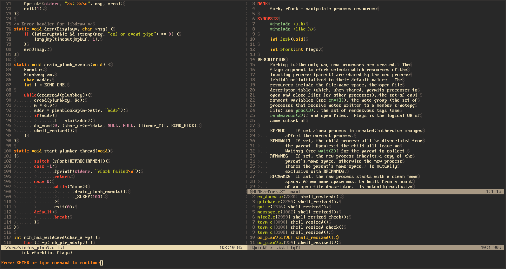

# vim
This is a plan9 port of the vim editor.
The port was initially done by stefanha (see https://vmsplice.net/9vim.html).

This fork builds on the initial port and brings a couple extra features (plumber, mouse support) but also bug fixes (mainly shell command execution).



## plan9 integration:
Here are a couple of things I use to help with integration within plan9.  
VIM loads its configuration from `$home/lib/vimrc`.

### mk
To make `mk` output recognized by `quickfix`, use the following:
```
set errorformat+=%tarning:\ %f:%l\ %m
set errorformat+=%tarning:\ %f:%l[%.%#]\ %m
set errorformat+=%f:%l\ %m
set errorformat+=%f:%l[%.%#]\ %m
autocmd BufReadPost quickfix nnoremap <buffer> <CR> <CR>
```

### grep
I use `g` for grepping through code. You can modify the `grepprg` variable to do this:
```
set grepprg=g\ $*
```

### man pages
The included `man.vim` plugin is modified to work on plan9.
First you need to load the plugin:
```
runtime ftplugin/man.vim
```
You can now look at man pages using
```
:Man <keyword>
```
In addition, you can change the `keywordprg` variable to display man pages when pressing the `K` key over a keyword:
```
set keywordprg=:Man
```

### function signatures
I use the following function to display the signature of the function under the cursor:
```
function! s:Sig()
	echo system("sig ".expand("<cword>"))
endfunction
command! Sig call s:Sig()
```

### git diff
I use the following function to display the result of `git/diff` in the current directory as a diff file:
```
function! s:GitDiff()
	32 new
	setlocal buftype=nofile
	:.!git/diff
	setlocal ft=diff
endfunction
command! Gd call s:GitDiff()
```

## Issues
- Input is borked (nothing beyong ascii, leader key, etc.)
- Other things I'm sure

